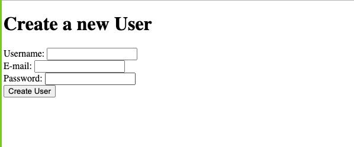
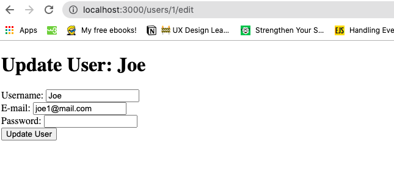

# Project: Re-Former

> This project involved creating a form using the rails form helper methods and  set up validation its fields.






## Built With

- Ruby on Rails
- MacOS
- VSCode

## Getting Started

To get a local copy up and running follow these simple example steps.

### Prerequisites

1. Ruby v.2.7.1
2. Rails 6.0.3.

### Setup

1. Clone this repository by using the Terminal to navigate to the desired location on your computer and then enter the following line of code into the Terminal:
```
git clone git@github.com:Maryjanee/re-former.git
```
2. Run `cd re-former` to move inside the downloaded repository.
3. Run `bundle install` to download the project's dependencies.
4. Run `rails db:migrate` to set up your local database.
5. Run `rails server` and navigate to http://localhost:3000/users/new in a web browser to view the user creation form.
6. To update a user navigate to: http://localhost:3000/users/:id/edit where :id is the id of the user you wish to modify.


## Authors

👤 **Maryjane Akpagbue**

- Github: [Maryjanee](https://github.com/Maryjanee)
- Twitter: [Maryjane Akpagbue](https://twitter.com/alfredmaryjane)
- Linkedin: [Maryjane Akpagbue](https://www.linkedin.com/in/maryjane-akpagbue)

👤 **Joe Burke**

- Github: [@Joseph-Burke](hhttps://github.com/Joseph-Burke)
- Twitter: [@__joeburke](https://twitter.com/__joeburke)
- Linkedin: [Joseph Burke](https://www.linkedin.com/in/--joeburke)


## 🤝 Contributing

Contributions, issues and feature requests are welcome!

Feel free to check the [issues page](issues/).

## Show your support

Give a ⭐️ if you like this project!

## Acknowledgments

- Microverse
- Odin Project

## 📝 License

This project is [MIT](lic.url) licensed.